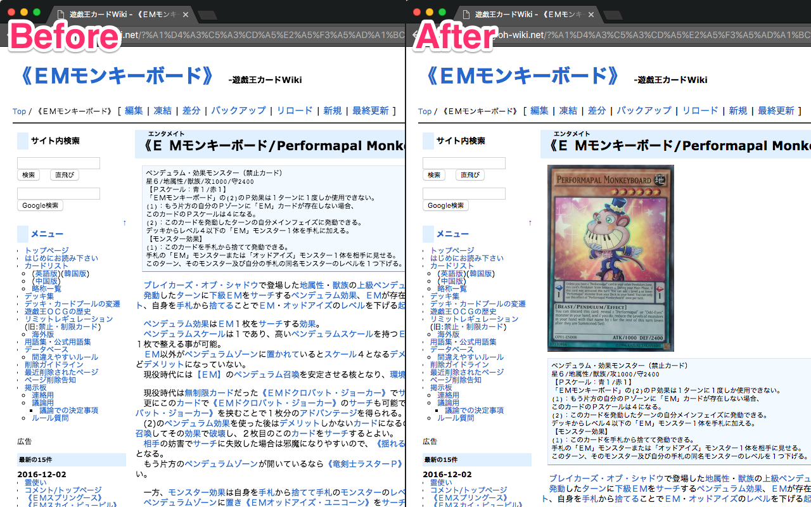

# カード画像 for 遊戯王カードWiki

> :flower_playing_cards: [遊戯王カードWiki](http://yugioh-wiki.net/)でカード画像を表示する Chrome/Firefox Extension

## インストール

**Chrome**: https://chrome.google.com/webstore/detail/npideaikogpbodfhcdcaabjnccclkfcb  
Version 55 以上が必要です。

**Firefox**: https://addons.mozilla.org/en-US/firefox/addon/card-image-for-yugioh-card-wik/  
Version 52 以上が必要です。

## 機能

[遊戯王カードWiki](http://yugioh-wiki.net/)のカードのページを訪れた時、カードの画像を[Yu-Gi-Oh! Wikia!](http://yugioh.wikia.com/wiki/Yu-Gi-Oh!_Wikia)から検索して表示します。
多くの場合、海外版の画像が優先的に表示されます。

## ライセンス

[MIT](https://choosealicense.com/licenses/mit/)
